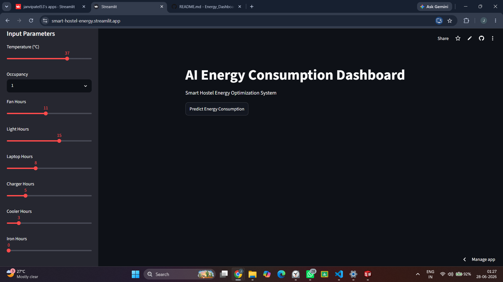
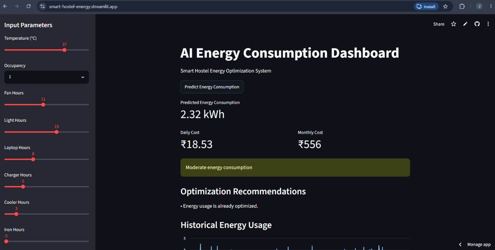
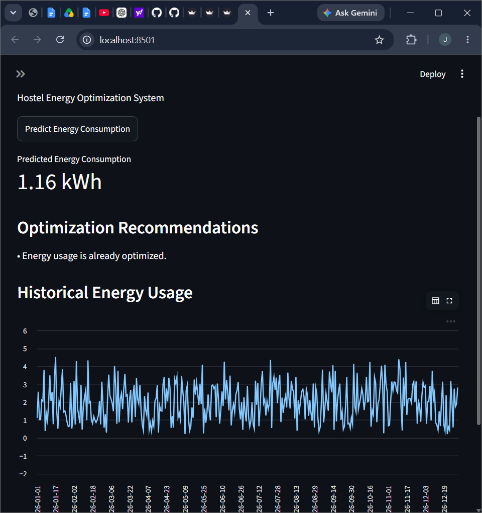

# Smart Hostel Energy Optimization Dashboard

This project predicts the daily energy consumption of a hostel room based on appliance usage and room conditions. It also provides recommendations to help reduce unnecessary electricity usage.

The dashboard takes inputs such as temperature, occupancy, and usage hours of appliances like fans, lights, laptops, chargers, coolers, and iron. Based on these inputs, the system predicts energy consumption in kWh and estimates electricity cost.

It also suggests simple optimization steps such as reducing cooler usage or improving ventilation to improve energy efficiency.

## Live Demo

Add your deployed app link here.

Example:
https://your-streamlit-link.streamlit.app

---

## Features

* Predicts daily energy consumption using machine learning
* Estimates daily and monthly electricity cost
* Provides energy-saving recommendations
* Displays historical energy usage trends
* Interactive dashboard built using Streamlit

---

## Tech Stack

* Python
* Pandas
* NumPy
* Scikit-learn
* Matplotlib
* Seaborn
* Streamlit

---

## Machine Learning Model

Linear Regression is used for predicting energy consumption.

### Model Performance

* R² Score: 0.988
* MAE: 0.099
* RMSE: 0.113

---

## Project Workflow

1. Generated synthetic energy consumption dataset for 365 days
2. Performed exploratory data analysis
3. Trained machine learning model
4. Built rule-based recommendation system
5. Developed and deployed interactive dashboard

---

## Project Structure

```bash
energy-dashboard/
│
├── dataset/
│   └── energy_data.csv
├── app.py
├── generate_data.py
├── eda.py
├── train_model.py
├── requirements.txt
└── README.md
```

---

## Installation

Clone repository:

```bash
git clone <repo-link>
```

Install dependencies:

```bash
pip install -r requirements.txt
```

Run application:

```bash
streamlit run app.py
```
https://smart-hostel-energy.streamlit.app/

---
## Screenshots

### Dashboard Home


### Prediction Result — Energy Prediction


### Prediction Result — Graph

---

## Future Improvements

* Train model on real-world smart meter data
* Improve recommendation system using advanced ML
* Add more detailed analytics and visualizations
